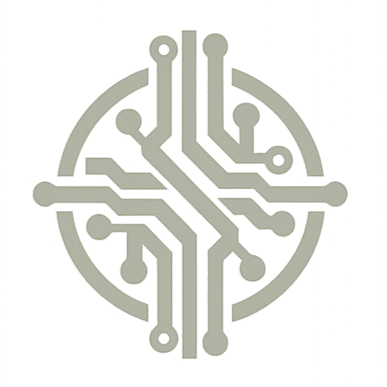

<div align="center">



<br/>

```
O R I O N   I N D U S T R I E S
```

**`Technology that disappears. Intelligence that remains.`**

<br/>

[]()
[]()
[]()
[]()
[]()
[]()
[]()
[]()
[]()
[]()
[]()

<br/>

[English](#english) · [Français](#français) · [Español](#español) · [中文](#中文) · [العربية](#العربية)

<br/>

</div>

---

<a name="english"></a>
## 🌐 English

### Vision

> *"Tomorrow, technology will no longer be visible. It will be everywhere — silent, integrated into our environment, capable of understanding what we do to help us before we even ask.*
>
> *This is why Orion Industries was created: to design this new generation of intelligent systems, where technology fades away to become a natural extension of human intelligence."*
>
> — **Théo ANDRIMANANARISOA**, Founder & CEO

### About

**Orion Industries** is a global technology holding company engineering the next generation of intelligent systems — where hardware, software, and artificial intelligence converge into seamless, invisible experiences.

Operating across the full spectrum of technology — from embedded electronics and IoT, to cloud infrastructure, AI, robotics, and human-centered design — the group is driven by one conviction: **technology must disappear into the environment and work *with* humans, not *at* them.**

### Divisions

<div align="center">

| Division | Domain | Status |
|:---|:---|:---:|
| ⬡ **Orion Software** | Enterprise software · SaaS platforms · Custom development | `Active` |
| ⬡ **Orion AI Systems** | Artificial intelligence · Machine learning · Autonomous systems | `Active` |
| ⬡ **Orion Hardware** | Electronic design · Embedded systems · PCB engineering | `Active` |
| ⬡ **Orion Robotics** | Industrial robotics · Collaborative automation | `Active` |
| ⬡ **Orion IoT & Smart Systems** | Connected devices · Domotics · Smart environments | `Active` |
| ⬡ **Orion Cloud & Infrastructure** | Cloud architecture · DevOps · Cybersecurity | `Active` |
| ⬡ **Orion Labs** | Applied R&D · Technology incubation · Research | `Active` |
| ⬡ **Orion Studio** | UI/UX design · Product design · Brand identity | `Optional` |

</div>

### Architecture

```
orion-industries/
│
├── apps/
│   ├── web/            ── Public platform        React 18 · Vite · Tailwind v4
│   ├── api/            ── Backend API             NestJS · Prisma · PostgreSQL
│   └── admin/          ── Internal dashboard      React 18 · Vite · Tailwind v4
│
├── packages/
│   ├── ui/             ── Shared component library
│   ├── types/          ── Shared TypeScript types & interfaces
│   ├── utils/          ── Shared helpers, validators, formatters
│   ├── i18n/           ── Internationalization    EN · FR · ES · ZH · AR · PT · HI
│   ├── testing/        ── Shared mocks, fixtures, test helpers
│   └── config/         ── Shared env schemas, constants, routes
│
├── infrastructure/     ── Docker · Nginx · Monitoring · Deployment
├── scripts/            ── DB · Build · Deploy automation
└── docs/               ── Architecture · API · Security · Conventions
```

### Tech Stack

**Frontend** — `apps/web` & `apps/admin`

| Layer | Technology |
|:---|:---|
| Framework | React 18 + Vite |
| Language | TypeScript 5 |
| Styling | Tailwind CSS v4 |
| State | Zustand |
| Routing | React Router v6 |
| HTTP | Axios |
| Real-time | Socket.io Client |
| i18n | i18next + react-i18next |

**Backend** — `apps/api`

| Layer | Technology |
|:---|:---|
| Framework | NestJS 10 |
| Language | TypeScript 5 |
| ORM | Prisma |
| Database | PostgreSQL 16 |
| Auth | JWT + Passport.js |
| Real-time | Socket.io (WebSockets) |
| Validation | class-validator + class-transformer |
| Security | Helmet + @nestjs/throttler |

### Getting Started

**Prerequisites**

```bash
node  >= 20.0.0
npm   >= 10.0.0
git   >= 2.40.0
docker + docker-compose
```

**Setup**

```bash
# 1 — Clone
git clone https://github.com/orion-industries/orion-industries.git
cd orion-industries

# 2 — Environment
cp .env.example .env

# 3 — Install
npm install
```

**Run locally**

```bash
# Docker (recommended)
npm run docker:up

# Manual
npm run dev
```

| Service | URL |
|:---|:---|
| Web | http://localhost:5173 |
| API | http://localhost:3000 |
| Admin | http://localhost:5174 |
| Swagger | http://localhost:3000/api/docs |
| PostgreSQL | localhost:5432 |

**Commands**

```bash
npm run dev              # Start all apps
npm run build            # Build all apps
npm run test             # Run all tests
npm run lint             # Lint all packages
npm run db:migrate       # Apply DB migrations
npm run db:seed          # Seed database
npm run db:studio        # Prisma Studio
npm run db:reset         # ⚠️  Reset all data
npm run docker:up        # Start Docker stack
npm run docker:down      # Stop Docker stack
```

### Languages

<div align="center">

| `en` | `fr` | `es` | `zh` | `ar` | `pt` | `hi` |
|:---:|:---:|:---:|:---:|:---:|:---:|:---:|
| English | Français | Español | 中文 | العربية | Português | हिन्दी |
| ✅ Primary | ✅ Active | 🔄 Planned | 🔄 Planned | 🔄 Planned | 🔄 Planned | 🔄 Planned |

</div>

### Team

| Role | Name |
|:---|:---|
| Founder & CEO | **Théo ANDRIMANANARISOA** |
| Co-founder | *Open — to be announced* |

### License

```
Copyright © 2025 Orion Industries. All rights reserved.
Proprietary & Confidential. Unauthorized use strictly prohibited.
```

---

<a name="français"></a>
## 🇫🇷 Français

### Vision

> *"Demain, la technologie ne se verra plus. Elle sera là, partout, silencieuse, intégrée à notre environnement, et capable de comprendre ce que nous faisons pour nous aider avant même qu'on le demande.*
>
> *C'est pour cela qu'Orion Industries a été créée : concevoir cette nouvelle génération de systèmes intelligents, où la technologie s'efface pour devenir une extension naturelle de l'intelligence humaine."*
>
> — **Théo ANDRIMANANARISOA**, Fondateur & CEO

### À propos

**Orion Industries** est une holding technologique mondiale qui conçoit la prochaine génération de systèmes intelligents — là où le hardware, le software et l'intelligence artificielle convergent pour créer des expériences seamless et invisibles.

Du circuit embarqué à l'infrastructure cloud, en passant par l'IA, la robotique et le design centré humain, le groupe est animé par une conviction : **la technologie doit s'effacer dans son environnement et travailler *avec* l'humain, non *contre* lui.**

### Divisions

| Division | Domaine | Statut |
|:---|:---|:---:|
| ⬡ **Orion Software** | Logiciels d'entreprise · Plateformes SaaS · Développement sur mesure | `Actif` |
| ⬡ **Orion AI Systems** | Intelligence artificielle · Machine learning · Systèmes autonomes | `Actif` |
| ⬡ **Orion Hardware** | Conception électronique · Systèmes embarqués · Ingénierie PCB | `Actif` |
| ⬡ **Orion Robotics** | Robotique industrielle · Automatisation collaborative | `Actif` |
| ⬡ **Orion IoT & Smart Systems** | Objets connectés · Domotique · Environnements intelligents | `Actif` |
| ⬡ **Orion Cloud & Infrastructure** | Architecture cloud · DevOps · Cybersécurité | `Actif` |
| ⬡ **Orion Labs** | R&D appliquée · Incubation technologique · Recherche | `Actif` |
| ⬡ **Orion Studio** | Design UI/UX · Design produit · Identité de marque | `Optionnel` |

### Démarrage rapide

```bash
# Cloner le dépôt
git clone https://github.com/orion-industries/orion-industries.git
cd orion-industries

# Variables d'environnement
cp .env.example .env

# Installer les dépendances
npm install

# Lancer en local (Docker recommandé)
npm run docker:up

# Ou manuellement
npm run dev
```

### Licence

```
Copyright © 2025 Orion Industries. Tous droits réservés.
Logiciel propriétaire et confidentiel. Toute utilisation non autorisée est strictement interdite.
```

---

<a name="español"></a>
## 🇪🇸 Español

### Visión

> *"Mañana, la tecnología ya no será visible. Estará en todas partes — silenciosa, integrada en nuestro entorno, capaz de comprender lo que hacemos para ayudarnos antes incluso de que lo pidamos.*
>
> *Por eso se creó Orion Industries: para diseñar esta nueva generación de sistemas inteligentes, donde la tecnología se desvanece para convertirse en una extensión natural de la inteligencia humana."*
>
> — **Théo ANDRIMANANARISOA**, Fundador & CEO

### Acerca de

**Orion Industries** es una holding tecnológica global que diseña la próxima generación de sistemas inteligentes — donde hardware, software e inteligencia artificial convergen en experiencias invisibles y fluidas.

### Inicio rápido

```bash
git clone https://github.com/orion-industries/orion-industries.git
cd orion-industries
cp .env.example .env
npm install
npm run docker:up
```

### Licencia

```
Copyright © 2025 Orion Industries. Todos los derechos reservados.
Software propietario y confidencial. Uso no autorizado estrictamente prohibido.
```

---

<a name="中文"></a>
## 🇨🇳 中文

### 愿景

> *"明天，技术将不再可见。它将无处不在——沉默、融入我们的环境，在我们开口之前就能理解我们的需求并提供帮助。*
>
> *这就是 Orion Industries 创立的原因：设计新一代智能系统，让技术消融于环境之中，成为人类智慧的自然延伸。"*
>
> — **Théo ANDRIMANANARISOA**，创始人兼首席执行官

### 关于我们

**Orion Industries** 是一家全球技术控股公司，致力于打造下一代智能系统——硬件、软件与人工智能在此交汇，创造无缝、无形的体验。

### 快速开始

```bash
git clone https://github.com/orion-industries/orion-industries.git
cd orion-industries
cp .env.example .env
npm install
npm run docker:up
```

### 许可证

```
版权所有 © 2025 Orion Industries。保留所有权利。
专有且保密软件。严禁未经授权使用。
```

---

<a name="العربية"></a>
## 🇸🇦 العربية

<div dir="rtl">

### الرؤية

> *"غداً، لن تكون التكنولوجيا مرئية. ستكون في كل مكان — صامتة، مندمجة في بيئتنا، قادرة على فهم ما نفعله لمساعدتنا قبل أن نطلب ذلك.*
>
> *لهذا أُسِّست Orion Industries: لتصميم هذا الجيل الجديد من الأنظمة الذكية، حيث تتلاشى التكنولوجيا لتصبح امتداداً طبيعياً للذكاء البشري."*
>
> — **Théo ANDRIMANANARISOA**، المؤسس والرئيس التنفيذي

### نبذة عنا

**Orion Industries** هي شركة قابضة تكنولوجية عالمية تعمل على هندسة الجيل القادم من الأنظمة الذكية — حيث يتقاطع الأجهزة والبرمجيات والذكاء الاصطناعي لإنشاء تجارب سلسة وغير مرئية.

### البدء السريع

```bash
git clone https://github.com/orion-industries/orion-industries.git
cd orion-industries
cp .env.example .env
npm install
npm run docker:up
```

### الترخيص

```
حقوق النشر © 2025 Orion Industries. جميع الحقوق محفوظة.
برنامج خاص وسري. يُحظر الاستخدام غير المصرح به بشكل صارم.
```

</div>

---

<div align="center">


<br/>

**ORION INDUSTRIES**

*Technology that disappears. Intelligence that remains.*

<br/>

`Copyright © 2025 Orion Industries — All rights reserved`

</div>